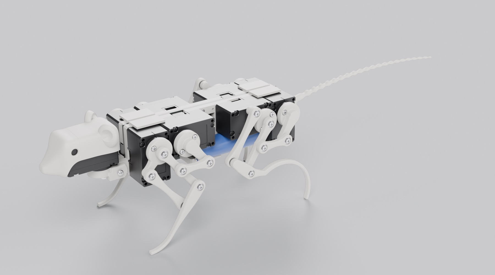
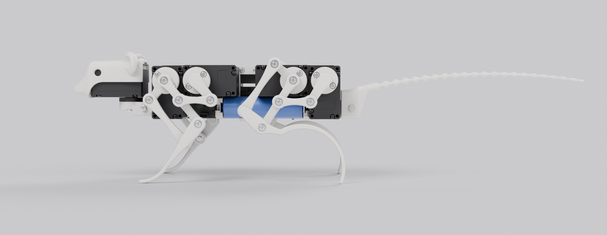
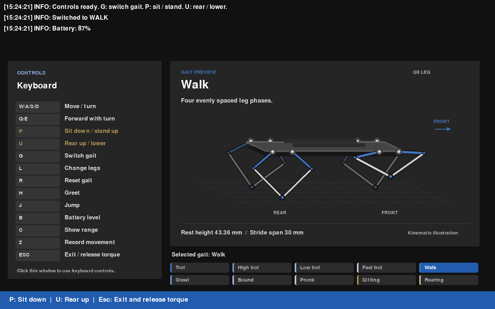

# RatBot

**Looking for hardware files? The STL files for every printed part are in the [Releases](https://github.com/SamedVossberg/RatBot/releases) section of this repository.**

RatBot is a small quadruped robot shaped like a rat. It is built on [Q8bot](https://github.com/EricYufengWu/q8bot) by Yufeng (Eric) Wu and keeps its electronics and software: the Q8bot main PCB, which the leg servos plug into directly without cables, eight DYNAMIXEL XL330-M077-T servos for the legs, an ESP-NOW link between two Seeed Studio XIAO ESP32C3 boards, and the Python control GUI on the laptop. The body is new. Double parallelogram limbs based on the SQuRo robotic rat ([Shi et al., IEEE Transactions on Robotics, 2022](https://doi.org/10.1109/TRO.2022.3159188)) replace the Q8bot five bar legs, a head sits on a ninth servo, and a passive tail is mounted at the back.

<p align="center">
  
</p>

## Hardware

| | |
|---|---|
| Size | 335 mm from nose to tail tip (188 mm without the tail), 80 mm wide, 83 mm tall standing |
| Mass | 297 g as modelled, of which 46 g is printed PA12 |
| Servos | 9 × DYNAMIXEL XL330-M077-T: two per leg and one for the head |
| Legs | Double parallelogram limbs with six 692ZZ bearings each |
| Tail | Passive and printed in one piece, designed to clear the floor while standing and to touch down once the robot rears past about 20° |
| Electronics | Q8bot main PCB with a XIAO ESP32C3, two 14500 Li-ion cells |

<p align="center">
  
</p>

The [RatBot parts list](docs/instructions/ratbot_parts.md) gives the print quantities for all 18 STL files and the off-the-shelf parts, read from the Fusion design the STLs were exported from.

## Repository

| Folder | Contents |
|---|---|
| [`firmware/ratbot_robot`](firmware/ratbot_robot) | Robot firmware: receives joint targets over ESP-NOW and drives the leg servos |
| [`firmware/ratbot_controller`](firmware/ratbot_controller) | Firmware for the USB dongle that relays commands from the laptop |
| [`firmware/ratbot_motor_config`](firmware/ratbot_motor_config) | Initial servo setup, and tools for [replacing a single servo](firmware/ratbot_motor_config/REPLACE_ID18.md) |
| [`firmware/ratbot_servo_diagnostics`](firmware/ratbot_servo_diagnostics) | Read-only servo bus diagnostics and bounded tests of a single servo |
| [`python-tools`](python-tools) | The control GUI: gaits on keyboard or joystick, sitting and rearing poses, pose previews |
| [`docs/instructions`](docs/instructions) | Sourcing, assembly and software setup guides from Q8bot, plus the [RatBot parts list](docs/instructions/ratbot_parts.md) |

## Getting Started

1. Print the parts from the latest release and get the hardware in the [parts list](docs/instructions/ratbot_parts.md).
2. Configure new servos (ID, baud rate, drive mode) with `firmware/ratbot_motor_config`, following steps 10 to 13 of [Robot Assembly](docs/instructions/robot_assembly.md).
3. Flash `firmware/ratbot_robot` to the robot and `firmware/ratbot_controller` to the dongle with [PlatformIO](https://platformio.org/).
4. Start the GUI:

```bash
cd python-tools
python -m venv venv
source venv/bin/activate
pip install -r requirements.txt
cd ratbot
python operate.py
```

[Software Setup](docs/instructions/software_setup.md) covers pairing and troubleshooting. The [python-tools README](python-tools/README.md) describes the sitting (**P**) and rearing (**U**) poses, fault recovery (**X**) and the tests that run without hardware.

<p align="center">
  
  <br>
  <em>The control GUI. Its previews still draw the Q8bot legs, see Status.</em>
</p>

## Status

- **The gaits still use Q8bot kinematics.** The gait generator and inverse kinematics in `python-tools` model the Q8bot five bar leg (19.5 mm between the servo axes, 25 mm and 40 mm links). RatBot's limbs map servo angles to foot positions differently, so the gaits, poses and previews need porting to the new limb geometry before the foot paths match this robot.
- **No limb mounting angles yet.** `ratbot_motor_config` finishes by moving the servos to the Q8bot leg mounting positions. The matching positions for RatBot's limbs are not defined yet.
- **The head servo is not driven yet.** The firmware addresses the eight leg servos (IDs 11 to 18) only.
- **The PCB is the Q8bot board, unchanged.** Its Gerber and BOM files are in the [Q8bot releases](https://github.com/EricYufengWu/q8bot/releases) and on its [PCBWay project page](https://www.pcbway.com/project/shareproject/Q8bot_PCB_Robot_dfa65114.html).

## Credits and License

RatBot is derived from [Q8bot](https://github.com/EricYufengWu/q8bot) by Yufeng (Eric) Wu. The firmware, python-tools and setup guides started from Q8bot at commit `f86fefc`. The first commit of this repository holds those files unchanged, so the history after it shows everything RatBot changed. If you build on this work, please also cite the Q8bot papers: [design, IROS 2025](https://ieeexplore.ieee.org/abstract/document/11246322) and [control and data acquisition, UR 2025](https://ieeexplore.ieee.org/abstract/document/11078123/). The limb geometry follows SQuRo by [Shi et al.](https://doi.org/10.1109/TRO.2022.3159188)

Like Q8bot, this repository is released under the [MIT License](LICENSE).
